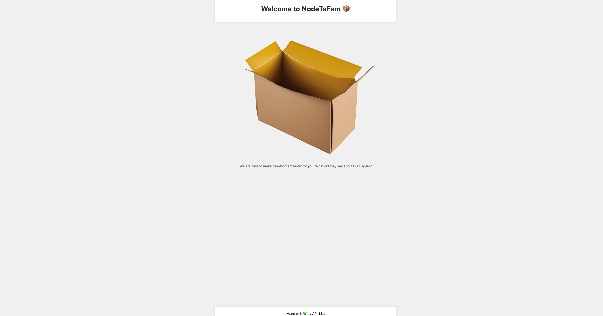
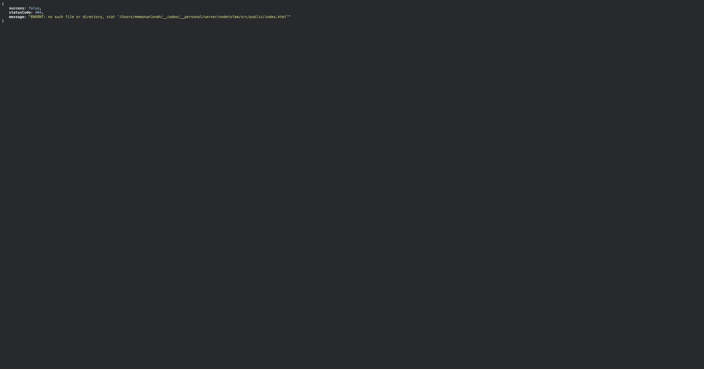

<div align="center">
  <a href="https://github.com/emmanuelonah/nodetsfam">
    
  </a>
</div>

<h1 align="left" style="font-size:40px;">NodeTsFam NodeJs Framework</h1>

# Description 📦

<p style="font-size:11px;">NodeTsFam is an acronym for <span style="color:green">NodeJs Typescript Framework</span></p>

The "NodeTsFem" project provides a custom setup for Node.js development, designed to make it easy for developers to bootstrap a new project. It uses TypeScript for static typing and includes pre-configured tools and scripts for building, testing, and running the application.

This project aims to reduce the time and effort required to start a new Node.js project by providing a ready-to-use environment that follows current best practices. It's perfect for developers who want to focus on writing their application code, without having to worry about setting up the development environment from scratch.

Whether you're a seasoned Node.js developer or just getting started, "NodeTsFem" can help you kickstart your next project quickly and efficiently.

# Technologies used

1. [Express](https://expressjs.com/)
2. [Typescript](https://www.typescriptlang.org/)
3. [Docker](https://www.docker.com/)
4. [Jest](https://jestjs.io/)
5. [Mongo DB](https://www.mongodb.com/)
6. [Sqlite3 DB](https://www.sqlite.org/docs.html)

# Processes

1. [Eslint](https://eslint.org/)
2. [Prettier](https://prettier.io/)
3. [Git Hooks Husky](https://typicode.github.io/husky/)
4. [Git Action](https://docs.github.com/en/actions)

# Database used

_Out of the box, we support MongoDB(using [Moongose](https://mongoosejs.com/) as the ODM) and SQLite3(using [Sequelize](https://sequelize.org/) as the ORM)_. But you can plugin your own db [here](./src/db/)

# Architecture used(`MVC`)

[This project uses the MVC software design pattern](https://en.wikipedia.org/wiki/Model%E2%80%93view%E2%80%93controller)

# Scripts

__Ensure you are using the specified node version__
If you have nvm, run the below command to select the latest node version:

```bash
nvm use
```

## Dependencies installation

```bash
yarn
```

## Development server

```bash
yarn run dev
```

Open [http://localhost:8080](http://localhost:8080) with your browser to see the result.

### If the server startup was successful, you should see the below view



### If you try accessing an un-existing route, you will see an API response like below



## Production build

```bash
yarn run build
```

## Run unit tests

```bash
yarn run test
```

## Run unit tests coverage

```bash
yarn run test:coverage
```

## Lint errors

```bash
yarn run lint
```

## Format errors

```bash
yarn run format
```

# Env variable sample you could just use

create a file in the root folder called `.env` and paste the below data

```bash
NODETSFAM_APP_NAME="NodeTsFam"
NODETSFAM_SERVER_PORT=8080
NODETSFAM_SERVER_URL="https://localhost:8080"
```

<p style="color:red;">The below `env vars` are optional</p>

```bash
NODETSFAM_MONGO_DB_URI="If you chose to opt-in for mongo db,then paste in your db_uri"

NODETSFAM_CLIENT_URL="if a website will be using your server, then paste in the URL e.g: <http://localhost:4000>"

NODETSFAM_CLIENT_PORT="if a website will be using your server, then paste in the PORT e.g: 4000"

```

# Real life usage of this project

[Youtube Video coming soon]()
